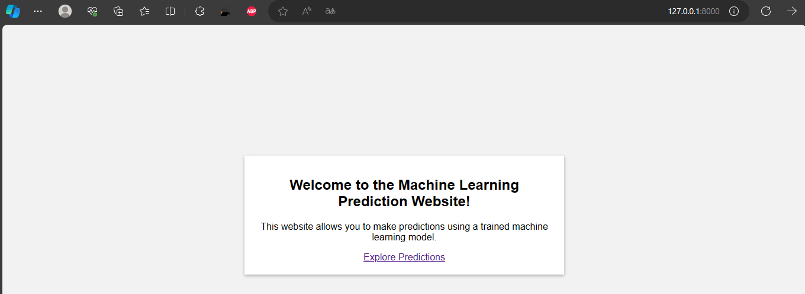
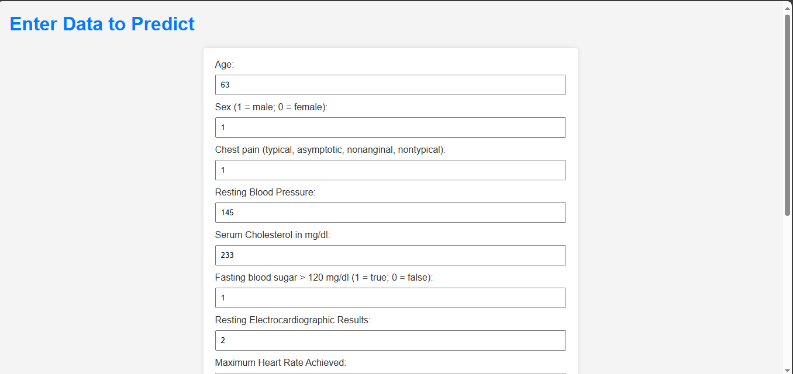
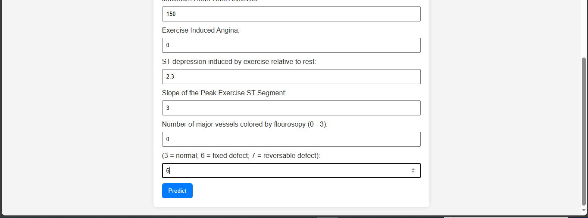
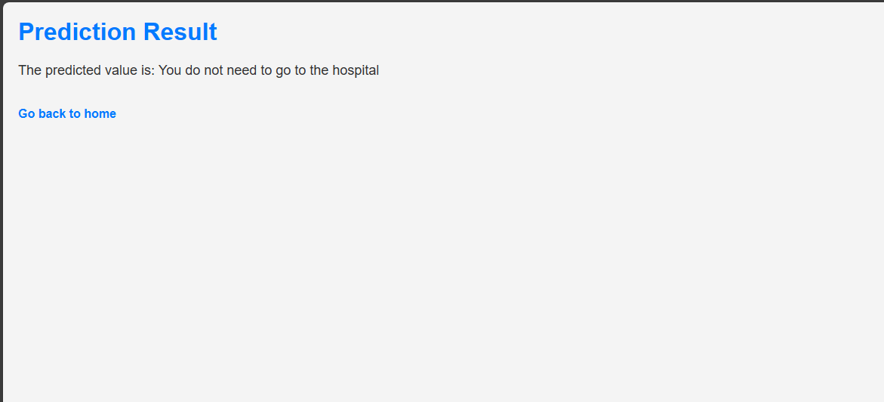
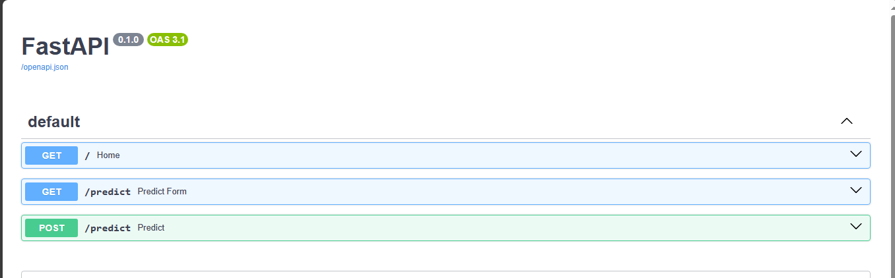

## the dataset
[Press here](https://www.kaggle.com/datasets/volodymyrgavrysh/heart-disease)
## the steps:

{:height=200;width=600}

{:height=200;width=600}

{:height=200;width=600}

{:height=200;width=600}

{:height=200;width=600}

